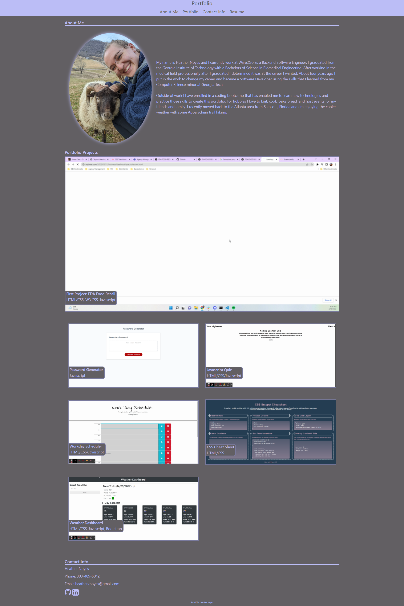

# HNoyesPortfolio

## Description

This is a portfolio page that contains many of my projects and about me information. The motivation for this project was to practice advanced CSS skills in order to showcase an ever increasing project base as I learn new skills. I created an accessible and semantic HTML skeleton of my content and used things like flexbox within the stylesheet to create a mobile first compatible website.

Certain points of interest that I was particularly keen on creating were the various contact links and resume link, the styling behind the hovers over images, and the overall flow of the page. I also used a reset.css in order to start completely from scratch such that I could build a site that is capable of looking exactly the same on every browser type.

With the ongoing completion of this project I fulfilled the following user acceptance criteria.

```
GIVEN I need to sample a potential employee's previous work
WHEN I load their portfolio
THEN I am presented with the developer's name, a recent photo or avatar, and links to sections about them, their work, and how to contact them
WHEN I click one of the links in the navigation
THEN the UI scrolls to the corresponding section
WHEN I click on the link to the section about their work
THEN the UI scrolls to a section with titled images of the developer's applications
WHEN I am presented with the developer's first application
THEN that application's image should be larger in size than the others
WHEN I click on the images of the applications
THEN I am taken to that deployed application
WHEN I resize the page or view the site on various screens and devices
THEN I am presented with a responsive layout that adapts to my viewport
```

This project taught me how I can create and edit a site from scratch. I was able to utilize advanced css techniques like variables, media queries, universal selectors, and gradients to create a cohesive portfolio site that I can be proud of. I plan to keep updating this site with future projects to replace the placeholder images. I also plan to create a bit of a different layout for the projects themselves. I would like to see a more randomized view with boxes that can grow and shrink based on hovering over them.

## Installation

1. Download all files within the main directory as well as the assets directory to your device.

2. Open the index.html file in your browser to view the website.

3. If future edits need to be made then the stylesheet can be found under ./assets/css/style.css. Any accompanying images can be placed in ./assets/images/ and any downloadable documents can reside in ./assets/docs/.

## Usage

The following image shows the web application's appearance:



You can view the deployed application here: https://heatherknoyes.github.io/HNoyesPortfolio/

## License

Distributed under the MIT License. See LICENSE.txt for more information.
